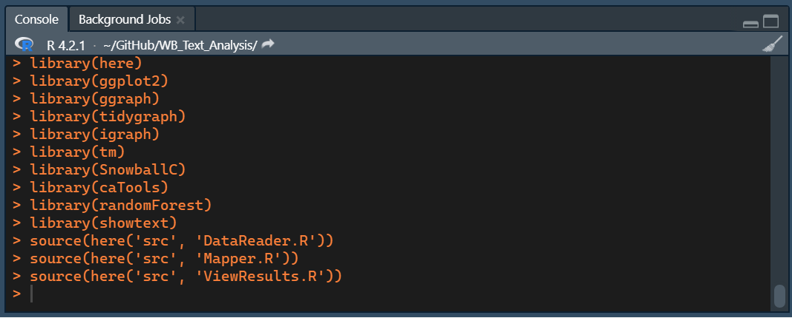

---
output:
  pdf_document: default
  html_document: default
---
SDG Mapping Tool
================

***A tool for mapping the projects of the World Bank to the SDGs***

**Authors:** *Stockholm Environment Institute (SEI)*

# Introduction

This RMarkdown file showcases the SDG Mapping Tool developed by the Stockholm Environment Institute - Latin America Center - to automate and improve the process of mapping how different WB projects are connected to the SDG targets. This exercise is based upon the mapping methodology developed by SEI to use for World Bank projects from the FY20 and the FY21 portfolios and the KH coder text-mining protocol for the same years.

The script detailed below is written in the R programming language and employs the Random Forest Machine Learning algorithm, which belongs to the supervised learning techniques. It is based in ensemble learning, combining multiple classifiers to solve complex classification problems. Furthermore, in addition to classifying the WB projects to the SDGs, this script also includes the automatic generation of visualizations.

**General objective**

- Develop a memo explaining the updated mapping methodology, including detailed guidance to allow independent mapping by the World Bank.

**Features included within the script**

1.	Text information extraction from the diverse WB documentation pdfs
2.	Random Forest Machine Learning classification model with an 80% of precision
3.	Classification of WB projects to the SDGs
4.	Visualizations

# Download R and Rstudio
*First, download and install R, then install RStudio* 

[Install R](https://cran.r-project.org/bin/windows/base/)
[Install RStudio](https://posit.co/download/rstudio-desktop/)

# Running the app

The script should be used with **R 4.2.1** or more recent. Also, it has been tested on **Windows 10 and 11** machine with 8 Gb RAM and 2100 Mhz 6-core processor, so we recommend using a machine with those characteristics or better if you want to analyze many documents. Regarding the OS, we advice to use the same we used to test the script.

For running the script, you should open the _"SDG Mapper Tool.Rproj"_ file, located in the main directory of the app – i.e., the main folder that contains the app's files. When you open the app for the first time, you may need to open the app's script. To do it, you can click on _File_ in the RStudio toolbar, and look for the _SDG_Map.R_ file, located in the same folder as _"SDG Mapper Tool.Rproj"_.

After that, you should see a file that begins with the following lines of code:

```{r Code example, eval=FALSE, include=FALSE}
library(here)
library(ggplot2)
library(ggraph)
library(tidygraph)
library(igraph)
library(tm)
library(SnowballC)
library(caTools)
library(randomForest)
library(showtext)
source(here('src', 'DataReader.R'))
source(here('src', 'Mapper.R'))
source(here('src', 'ViewResults.R'))
```

These lines are there to set up the initial environment conditions needed for running the app. They will import libraries and functions that are used for the analysis.

To run the app, you must run every code expression in order. Each time you press _Ctrl + ENTER_, an expression will be run. Expressions may consist of multiple lines of code, so if you want to check what you run when pressing _Ctrl + ENTER_, you can always check the console.



## Importing packages

This program requires to install and import external libraries for its functioning. They are _cli_, _ggplot2_, _ggraph_, _glue_, _here_, _igraph_, _jsonlite_, _pdftools_, _readr_, _showtext_, _sysfonts_, _tidygraph_, _tidytext_, and _tidyverse._ If you have them installed (for example, if you are using the SDG Mapper for the first time), you can skip the following chunk to import them. However, **if you need to install the packages**, you can do it here:

```{r message=FALSE, eval=FALSE}
install.packages('cli')
install.packages('ggplot2')
install.packages('ggraph')
install.packages('glue')
install.packages('here')
install.packages('igraph')
install.packages('jsonlite')
install.packages('pdftools')
install.packages('readr')
install.packages('showtext')
install.packages('sysfonts')
install.packages('tidygraph')
install.packages('tidytext')
install.packages('tidyverse')
install.packages('tm')
install.packages('caTools')
```

In addition to the external packages, the functions of the SDG Mapper must be sourced. Also, the fonts used for plotting must be initialized. You can do all of that with the next code chunk.

```{r Importing libraries, message=FALSE, warning=FALSE}
library(here)
library(ggplot2)
library(ggraph)
library(tidygraph)
library(igraph)
library(tm)
library(SnowballC)
library(caTools)
library(randomForest)
library(showtext)
source(here('src', 'DataReader.R'))
source(here('src', 'Mapper.R'))
source(here('src', 'ViewResults.R'))
source(here('src', 'AnalysisModule.R'))

initialise_fonts()
```

## Loading the dataset

There are two options for loading your data to the SDG Mapper. The first one is to create a new analysis and extract the texts of all the PDF files from a folder. The second one is to retrieve the saved data from a previous analysis. For your first run, you must **start a new analysis from scratch**.

### Start a new analysis from scratch

You can process the PDF files contained in a folder for mapping them to the SDGs. The following chunk of code can be modified for:

1. Specifying the name of the folder that contains the PDF files.
2. Choosing whether to save the tidy data (i.e., the pre-processed data that the model uses for classifying the documents).
3. The name of the output file.

You can adjust these variables using the first three lines of code in the chunk. 

1. `FOLDER` can receive any string (i.e., word/short sentence) between quotation marks as input. It is the name of the folder containing the PDFs and must be located inside the "PDF" folder in the main directory of this app (i.e., the folder containing the R Markdown file you opened).
2. `SAVE_RESULTS` must be either `TRUE` or `FALSE` without quotation marks. If you want to save the results, you must write `TRUE`.
3. `FILENAME` Is the name of the file that will be saved with the pre-processed data. It will be located in the *'Saves/data'* folder in the main directory of the app. You can write any string inside quotation marks.

```{r Extracting texts, message=FALSE}
FOLDERNAME <- 'PADs'    # Name of the folder that contains the PDF files
SAVE_RESULTS <- TRUE    # Must be TRUE or FALSE
FILENAME <- 'PADs'      # The name of the file that will contain the saved results

# Extracting the texts from all the PDF files in a folder
texts <- extract(FOLDERNAME)

# You can tidy the extracted texts
tidy <- tidify(texts,
               token='sentences',
               low_lim = 0.65,
               up_lim = 0.7,
               export_json = TRUE,
               version_name = FILENAME)
```

## Classification model

### Merging the training dataset with the input data

The training dataset is a collection of phrases that are mapped to the SDG Targets. They are imported as `data_training`. On the other hand, the _input data_ are the extracted texts from the PDFs, here named as `tidy`.

```{r message=FALSE}
# ----- Data set-up for the classification model ---------- 

# Import the data used for training the model
data_training <- read.csv(here('Settings/Training_data.csv'),
                          header = TRUE,
                          sep = ',')

# Combine the training data set with the extracted texts
data_complete <- rbind(data_training, tidy)

data_complete <- data_complete %>%
    mutate(Text = str_replace_all(data_complete$Text, '[^A-Za-z ]', ''))

# Capturing the data sets' length
nrows_data_t <- nrow(data_training)
nrows_data_c <- nrow(data_complete)

rm(data_training)
```

### Create the working data set using a Data Term Matrix (DTM) and the complete data set

```{r message=FALSE}
# Create a Document Term Matrix (DTM)
dtm <- corpus_dtm(data_complete)

# Create the working data set
working_dataset <- codify(dtm, data_complete)
rm(dtm) 
```

### Create the model and train it with the training data set

```{r Creating and training Random Forest Model, warning=FALSE}
# Set random seed
set.seed(612)

# Select training data
x_train <- working_dataset[1:nrows_data_t,]
x_train$Target <- factor(x_train$Target)

# Select test data
x_test <- working_dataset[nrows_data_t:nrows_data_c,]
x_test <- x_test %>% slice(-1)
x_test$Target <- factor(x_test$Target)

rm(working_dataset)

ncols_dtm <- dim(x_train)[2]

# Train the random forest model using the training data set
t0 <- Sys.time()
cli_alert_info(paste0("The model is being trained. Please wait, this", 
                      "process can take several minutes."))
classifier <- randomForest(x = x_train[, -ncols_dtm],
                           y = x_train$Target,
                           ntree = 51)
rm(x_train)
cli_alert_success(paste0(
    "The model was trained successfully after",
    difftime(time1 = t0, time2 = Sys.time(), units = "min")))
```

### Classifying the documents

```{r Classify the projects with the SDG Targets, warning=FALSE}
# Classify the input data -- Map the projects to the SDGs
y_pred <- predict(classifier, newdata = x_test[, -ncols_dtm])
rm(x_test)

# Save the results in a character vector
classified <- character()
for (goal in y_pred) {classified = c(classified, goal)}

# Subset the data frame and paste the classified data
results <- data_complete %>%
    slice(nrows_data_t+1: nrows_data_c)

rm(data_complete)

results$Target <- classified

results <- identify_SDGs(results)
results <- results %>% dplyr::filter(SDG %in% glue("SDG {1:17}"))
results <- as_tibble(results)
```

## Data analysis

### Creating summary data tables

The machine learning model outputs a table of texts mapped to the SDG Targets. First, we must identify the SDGs of every entry using the `identify_SDGs()` function.
Also, the data can be summarized using the `count_matches()`, `count_occurrence()`, `get_main_SDG()`, `get_SDGs_proj()`, `results_matrix`()`, and `get_network()` functions. These functions are used in the following code chunk to get the following tables:

1. **matches_T:** it is the total of matches to any SDG by project.
2. **matches_SDG:** it is the total of matches of all SDGs across the portfolio.
3. **matches_tgt** it is the total of matches of all SDG Targets across the portfolio.
4. **occurrence_SDG:** it is the number of projects that the SDGs have been mapped to.
5. **main_SDGs:** it is a table containing the most prominent SDG of every project.
5. **SDGs_proj:** it is the number of SDGs that every project is mapped to.
6. **matrix_relative:** it is a matrix with the mapping results in a wide format. The relative matrix displays the percentages that every SDG share from the total matches in a project.
7. **matrix_absolute:** it is a matrix with the mapping results in a wide format. The absolute matrix displays the total mappings of each SDG across the projects.
8. **net:** it is an _igraph_ network dataframe that can be plotted with _ggraph_.

```{r Data summaries, message=FALSE}
# Total matches by project -------------------------------> can feed a histogram
matches_T <- count_matches(results,
                           by = 'total_matches',
                           sorted = 'Frequency')

# Total matches by Project and SDG ---------------------> can feed a column plot
matches_SDG <- count_matches(results,
                             by = 'SDG',
                             sorted = 'Frequency',
                             collapse_projects = TRUE)

# Total matches by Project and Target ------------------> can be exported as csv
matches_tgt <- count_matches(results,
                             by = 'Target',
                             sorted = 'Frequency',
                             collapse_projects = TRUE)

# Binary occurrence results by SDG ---------------------> can be exported as csv
occurrence_SDG <- count_occurrence(results,
                                   by = 'SDG',
                                   collapse_projects = TRUE)


# Identify the main SDG in each project
# -------------------------------> can feed a column plot and be exported to csv
main_SDGs <- get_main_SDG(results,
                          from_binary = FALSE,
                          collapse_SDG = TRUE)

SDGs_proj <- get_SDGs_proj(results)

# Results as matrix ------------------------------------------------------------

matrix_relative <- results_matrix(results,
                                  relative_freqs = TRUE,
                                  with_main_SDG = TRUE)

matrix_absolute <- results_matrix(results,
                                  relative_freqs = FALSE,
                                  with_main_SDG = TRUE)

net <- generate_network(results)
```

### Exporting the summary data tables

These summary tables can be exported using the functions in the next chunk. The function `export_summary()` takes two arguments inside its brackets. The first argument is a summary data table (any of the ones created before). The second, is the name of the file exported. This function exports _'.csv'_ files to the folder _'Output/data'_, inside the main directory of this app.

```{r Exporting summaries, warning=FALSE}
export_summary(matches_T, 'total_matches_by_project')
export_summary(matches_SDG, 'total_matches_by_SDG')
export_summary(matches_tgt, 'total_matches_by_tgt')
export_summary(occurrence_SDG, 'occurrence_by_SDG')
export_summary(main_SDGs, 'main_SDGs_by_project')
export_summary(SDGs_proj, 'number_SDGs_by_project')
export_summary(matrix_relative, 'results_matrix_rel')
export_summary(matrix_absolute, 'results_matrix_abs')
```

## Data visualization

The SDG Mapper Tool can create six different plots for the analysis. They are:

1. **SDG Occurrence**.
2. **SDG Matches** across the portfolio.
3. **Main SDG**.
4. **Distribution of SDGs by Project**.
5. **Network graph**.

### SDG Occurrence

The SDG Occurrence plot is a bar plot showing the number of projects each SDG has been mapped to.

```{r Occurrence plot}
occurrence_SDG %>% plot_results(
    title = 'Occurrence of the SDGs',
    xlabel = 'SDG',
    ylabel = 'Number of projects',
    fontsize_barlabs = 7,
    fontsize_title = 30,
    fontsize_axis = 12,
    scale = 1,
    dpi = 96)
```

### SDG Matches

The SDG Matches shows a bar plot of the SDGs according to their number of matches across the World Bank's portfolio

```{r SDG Matches plot}
matches_SDG %>% plot_results(
    title = 'Matches by SDG',
    xlabel ='SDG',
    ylabel ='Number of matches',
    fontsize_barlabs = 7,
    fontsize_title = 30,
    fontsize_axis = 12,
    dpi = 96,
    scale = 1)
```

### Predominant SDG

The Predominant SDG chart shows a bar plot with the number of times that each SDG has been identified as the main SDG in a project. The Predominant SDG was identified using the mapping frequencies.

```{r Predominant SDG Plot}
main_SDGs %>% plot_results(
    title = 'Predominant SDGs',
    xlabel = 'SDG',
    ylabel = 'Number of projects',
    fontsize_barlabs = 7,
    fontsize_title = 30,
    fontsize_axis = 12,
    dpi = 96,
    scale = 1)
```

### Distribution of the number of SDGs by Project

The distribution of the number of SDGs by project is a histogram which displays the number of SDGs mapped in each project. Also, it identifies the _mean number of SDGs_ mapped in a project.

```{r SDG by Project Distribution}
results %>% plot_SDG_distribution(
    binwidth = 2,
    title = "Distribution of the number of SDGs",
    subtitle = "mapped by project",
    test = FALSE,
    fontsize_title = 20,
    fontsize_subt = 15,
    fontsize_axis = 12,
    dpi = 96)
```

### Network graph

This image shows the interconnection between the SDGs. We considered that two SDGs interact if they coexist in the same project. The network graph aggregates the coexistence of SDGs across the World Bank’s portfolio.

```{r Network graph}
plot_network(results)
```

